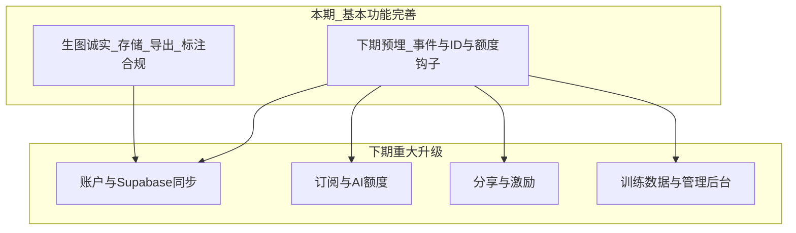

# EasytPack 现状复盘与下一步规划

> **阶段划分（已确认）**  
> - **本期（基本功能打磨）：** 先把沟通型工艺包做稳、好用。  
> - **下期重大升级：** 账户体系 · 订阅/AI 额度 · 分享激励 · 训练数据收集与管理后台。  
> - **本期必须为下期留好接口与数据形状，但不实现完整商业化/后台。**  
> 已取消单独推进的「数据飞轮先行」大包待办；相关能力并入「下期」+「本期准备项」。

---

## 一、项目现状（诚实评估）

**产品定位：** 沟通型工艺包——图供参考，以标注与表格为准（`COMM_PACK_COPY` / `lib/studio/region-edit-ux.ts`）。

**整体成熟度：约 65–70%**（可演示、可本地走通；尚不足以当「版师默认可信交付物」）。

| 模块 | 成熟度 | 说明 |
|------|--------|------|
| 主路径 首页→工作室→导出 | ~72% | 本地可跑通；无账号/跨设备 |
| 画布标注 | ~82% | 最强 |
| AI 标注 | ~72% | 一键已进 Studio 弹窗 |
| 多视角/线稿/局部重绘 | ~58% | 薄弱：失败易变占位图 |
| 工艺/BOM/尺寸/评语 | ~78% | 较完整 |
| 导出 | ~66% | Excel 可用；PDF 靠打印 |
| 持久化 / 商业化基建 | ~35% / ~5% | 仅本机；Supabase 脚手架未接线 |

**主要技术债：** `studio/page.tsx` 过大；0 测试；本地配额；生图信任问题。

---

## 二、产品两期路线

| 期 | 目标 | 不做 |
|----|------|------|
| **本期** | 交付可信、好用；预埋可扩展点 | 登录墙、付费、管理后台、真训练流水线 |
| **下期** | 账户、额度、分享激励、训练数据后台 | — |

---

## 三、本期目标（2–4 周）：好用 + 为下期留缝

**一句话：** 版师包「看得懂、信得过、打得开」；代码与数据形状能无痛接账户/额度/分享/训练后台。

### 3.1 用户可见（P0 / P1）

#### P0 — 生图诚实与可恢复
- 失败/占位必须明显标记；可重试、可删除  
- 收紧背面「示意」文案与失败路径  
- **验收：** 不会把占位图当真背面  

#### P0 — 本地存储可靠性 UX
- `/projects` 空间用量、清理缓存、保存失败引导  
- 可选：导出项目 JSON 备份  
- **验收：** 配额紧张可自助，不静默丢稿  

#### P1 — 导出给版师可读
- 打印清单 / 或确定性 PDF；封面与标注可读  
- **验收：** Chrome/Edge 样张可直接发沟通  

#### P1 — 标注与合规可行动
- 落点抽检；合规项可跳转；「一键补全」vs「一键标注」文案清晰  

#### P2 — studio 拆分 + 入口文案 + 冒烟清单
- 拆生图/标注 hooks；首页仅「进入画布」；关键路径手工清单  

### 3.2 下期预埋（本期必做、体量控制）— 「准备项」

原则：**只加钩子、统一 ID、规范事件形状；不建完整后台 UI、不上登录强制。**

| 下期能力 | 本期准备什么 | 落点建议 |
|----------|--------------|----------|
| **账户 / 数据接入** | ① 项目 ID 稳定（已有 `tp_…`）② `TechPackProject` 与未来 `tech_packs` 字段对齐文档 ③ `saveProject` 抽「Repository」接口（Local 实现 + 预留 Cloud）④ 扩展 `supabase/schema.sql` 注释/migration 草稿，**不强制接线** | `lib/project/storage.ts`、`supabase/schema.sql`、`types/project.ts` |
| **订阅 / AI 额度计数** | ① 所有 `/api/ai/*` 经统一 `meterAiCall({ action, projectId, units })` ② 本地先记 `ai_usage_local`（可清）③ 响应头/日志带 `action`+耗时，便于下期换成服务端扣费 | 新 `lib/ai/metering.ts`；各 route 入口一行调用 |
| **分享 / 激励** | ① 导出/定稿产生 `share_snapshot` 元数据钩子（时间、导出类型、匿名 pack 摘要 hash）② 合规「可分享」标志位预留（如 `exportHistory` 扩展）③ 不实现公开链接 | `lib/export/*`、`types/project.ts` |
| **训练数据收集** | ① 统一 `AiTelemetryEvent` 类型（action、ai_output 摘要、user_final 摘要、outcome、correction、consent）② 生图/标注/一键：在现有路径打点到本地队列（可导出 JSONL）③ 替换 view-gen「假 accepted」为真实 outcome 枚举 ④ **consent 字段**预留在项目上（默认 false） | `lib/training/*` 扩展；studio AI handlers；导出定稿点 |
| **管理后台** | ① 事件/用量 JSONL 导出（给未来 admin 导入）② schema 预留 `ai_events` / `pack_versions` / `ai_usage` 表定义 ③ 不写 `/admin` 页面 | `supabase/schema.sql` + `scripts/` 或项目页「导出质量日志」调试入口 |

**明确不做（留给下期）：** Auth UI、强制登录、Stripe/支付、公开分享页、Admin CRUD、向量库、模型微调。

---

## 四、下期重大升级（基本功能完善后启动）

按依赖顺序建议：

1. **Supabase Auth + `tech_packs` + Storage** — 云端主库，本机改缓存  
2. **服务端 AI 额度** — `meterAiCall` 改查订阅额度；超额拦截  
3. **分享链接 + 激励规则** — 基于本期 snapshot/consent  
4. **管理后台** — 审核 consent 数据、用量、训练样本整理、品类金标准  
5. **再谈** few-shot 回灌 / RAG / LoRA（有干净标注数据之后）

---

## 五、成功标准

### 本期
- 生图失败不可假成功；存储可自助；导出可发版师；合规可点跳  
- 存在：**Repository 抽象、AI metering 钩子、Telemetry 事件形状、consent 字段、schema 草稿**  
- 本地仍可完整使用（不依赖登录）

### 下期启动门槛（建议）
- 上述用户路径稳定 2 周以上  
- Telemetry JSONL / 导出可抽检  
- schema 与类型文档评审通过  

---

## 六、Todo 对照

| ID | 内容 | 期 |
|----|------|-----|
| p0-view-honesty | 生图诚实标记 | 本期 |
| p0-storage-ux | 存储 UX | 本期 |
| p1-export-quality | 导出可读 | 本期 |
| p1-annotate-compliance | 标注与合规 | 本期 |
| p2-studio-split | studio 拆分 + 冒烟 | 本期 |
| p2-entry-copy | 入口文案 | 本期 |
| prep-repo-meter | Repository + AI metering 钩子 | 本期准备 |
| prep-telemetry-consent | Telemetry 事件 + consent + 可导出 JSONL | 本期准备 |
| prep-schema-draft | Supabase schema 扩展草稿（events/usage/versions） | 本期准备 |
